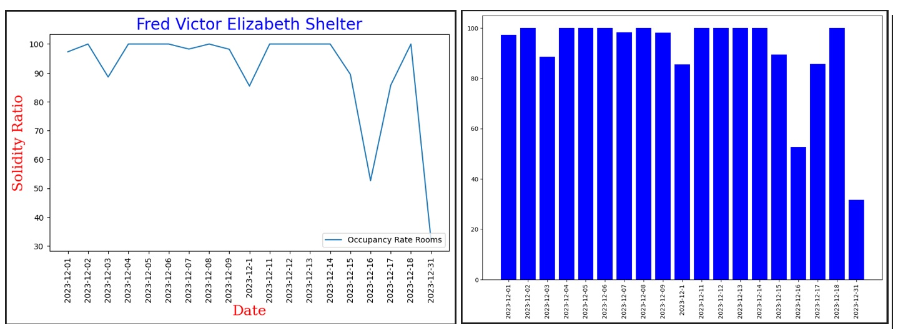
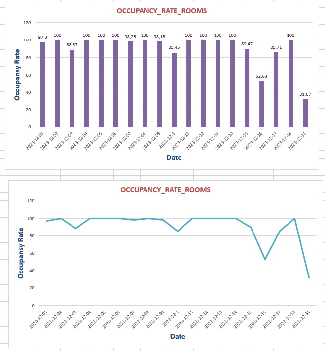

# Data Visualization

## Assignment 4: Final Project

### Requirements:
- We will finish this class by giving you the chance to use what you have learned in a practical context, by creating data visualizations from raw data. 
- Choose a dataset of interest from the [City of Toronto’s Open Data Portal](https://www.toronto.ca/city-government/data-research-maps/open-data/) or [Ontario’s Open Data Catalogue](https://data.ontario.ca/). 
- Using Python and one other data visualization software (Excel or free alternative, Tableau Public, any other tool you prefer), create two distinct visualizations from your dataset of choice.  
- For each visualization, describe and justify: 
    > What software did you use to create your data visualization?

    I used Python and Excel to create two distinct visualizations from my dataset.

    https://open.toronto.ca/dataset/daily-shelter-overnight-service-occupancy-capacity/

    

    

    > Who is your intended audience? 
    For both graphs.

    Local Government and Policy Makers : 
    To provide insights that can influence policy and funding decisions. This audience would need high-level overviews and trend analyses to understand 
    the impact on the community and allocate resources accordingly.

    Non-Profit Organizations : 
    To help assess the effectiveness of current programs and identify areas for improvement. They would be interested in both high-level trends and specific 
    data points that can guide program planning and resource distribution.
    
    > What information or message are you trying to convey with your visualization? 
   
    When I was visualizing, I only gave information about one shelter center, but if you examine my datasets, you will see that there are 112 shelter 
    centers in Ontario.  Almost all of them have an occupancy rate close to 100%. When you see this, it is clear that the shelter centers are insufficient 
    and their numbers need to be increased.
    
    > What design principles (substantive, perceptual, aesthetic) did you consider when making your visualization? How did you apply these principles? With what elements of your plots? 

    When creating a visualization for a topic like Toronto’s daily shelter occupancy capacity, it was important to keep a few design principles in mind to ensure the visualization was 
    informative, clear, and engaging.

    Substantive : I made sure the data used was up-to-date and represented actual shelter occupancy rates. Label the axes clearly, and include a descriptive title that captures 
    the essence of the visualization.

    Perceptual: I tried to choose the right color contrast and chart types.

    Aesthetic: I wanted to achieve a balanced layout where elements were evenly distributed and visually pleasing. I used design elements like fonts, colors, and 
    shapes to create a unified look.
    
    > How did you ensure that your data visualizations are reproducible? If the tool you used to make your data visualization is not reproducible, how will this impact your data visualization? 

    The dataset I used for data visualization is open data that anyone can access. I also used open-source Python to create this visualization, which is both open and reproducible. 
    If the dataset is public, we can see and perhaps imitate the visualizations that many people have created with this data. This way, we can come up with new ideas and 
    make the visualization more effective.

    If your data visualization is not reproducible, it means that the number of people who can access the data is limited and the visualization that can be made is limited 
    only by the ideas of the people who have access to this data. Examining the ideas of limited people will of course affect the work you will do.
    
    > How did you ensure that your data visualization is accessible?  

    Colour Contrast, Data labels and legend, different plot designs, clear font and font size, annotations.

    
    > Who are the individuals and communities who might be impacted by your visualization? 

    Local Government and Policy Makers, Non-Profit Organizations, decision makers, government officials, data analyst and reseachers.

    
    > How did you choose which features of your chosen dataset to include or exclude from your visualization? 

    Each dataset has a target column and features that directly affect this target column. In the data I examined of shelter occupancy rates by date in Toronto, 
    the most important data for me was the date and the occupancy rates on that date. Which dates the shelters were empty. I wanted to see the effects of seasonal 
    changes and weather on shelter preference. That's why I chose to visualize the date and occupancy rate.
    
    > What ‘underwater labour’ contributed to your final data visualization product?

    First of all, the data was huge, 112 separate shelters and one year of data for each shelter. It was almost impossible to visualize all of them, and even if I did, 
    it wouldn't make much sense to see it on a graph since the occupancy rates were always close to 100%. Therefore, I only used one month of data for one shelter in the visualization. 
    To do this, I did some grouping and cleaning of the data. I saved the new data and used it in both Excel and Python.

- This assignment is intentionally open-ended - you are free to create static or dynamic data visualizations, maps, or whatever form of data visualization you think best communicates your information to your audience of choice! 
- Total word count should not exceed **(as a maximum) 1000 words** 
 
### Why am I doing this assignment?:  
- This ongoing assignment ensures active participation in the course, and assesses the learning outcomes: 
* Create and customize data visualizations from start to finish in Python
* Apply general design principles to create accessible and equitable data visualizations
* Use data visualization to tell a story  
- This would be a great project to include in your GitHub Portfolio – put in the effort to make it something worthy of showing prospective employers!

### Rubric:

| Component         | Scoring  | Requirement                                                                 |
|-------------------|----------|-----------------------------------------------------------------------------|
| Data Visualizations | Complete/Incomplete | - Data visualizations are distinct from each other - Data visualizations are clearly identified - Different sources/rationales (text with two images of data, if visualizations are labeled) - High-quality visuals (high resolution and clear data) - Data visualizations follow best practices of accessibility |
| Written Explanations | Complete/Incomplete | - All questions from assignment description are answered for each visualization - Explanations are supported by course content or scholarly sources, where needed |
| Code              | Complete/Incomplete | - All code is included as an appendix with your final submissions - Code is clearly commented and reproducible |

## Submission Information

🚨 **Please review our [Assignment Submission Guide](https://github.com/UofT-DSI/onboarding/blob/main/onboarding_documents/submissions.md)** 🚨 for detailed instructions on how to format, branch, and submit your work. Following these guidelines is crucial for your submissions to be evaluated correctly.

### Submission Parameters:
* Submission Due Date: `HH:MM AM/PM - DD/MM/YYYY`
* The branch name for your repo should be: `assignment-4`
* What to submit for this assignment:
    * A folder/directory containing:
        * This file (assignment_4.md)
        * Two data visualizations 
        * Two markdown files for each both visualizations with their written descriptions.
        * Link to your dataset of choice.
        * Complete and commented code as an appendix (for your visualization made with Python, and for the other, if relevant) 
* What the pull request link should look like for this assignment: `https://github.com/<your_github_username>/visualization/pull/<pr_id>`
    * Open a private window in your browser. Copy and paste the link to your pull request into the address bar. Make sure you can see your pull request properly. This helps the technical facilitator and learning support staff review your submission easily.

Checklist:
- [ ] Create a branch called `assignment-4`.
- [ ] Ensure that the repository is public.
- [ ] Review [the PR description guidelines](https://github.com/UofT-DSI/onboarding/blob/main/onboarding_documents/submissions.md#guidelines-for-pull-request-descriptions) and adhere to them.
- [ ] Verify that the link is accessible in a private browser window.

If you encounter any difficulties or have questions, please don't hesitate to reach out to our team via our Slack at `#cohort-3-help`. Our Technical Facilitators and Learning Support staff are here to help you navigate any challenges.
